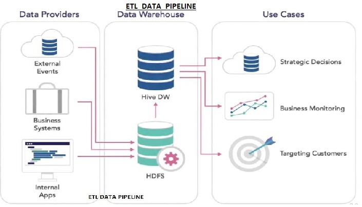
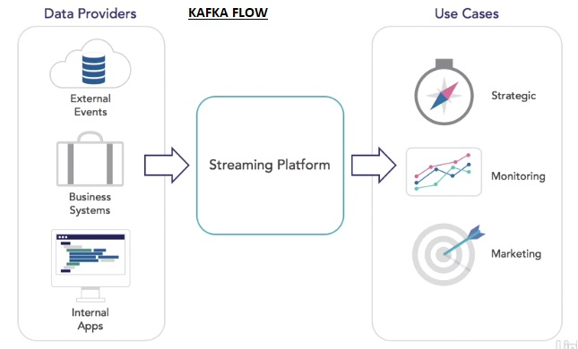

**Learning objectives**
  * Understanding the Kafka log
  * Creating topics
  * Partitioning topics across brokers
  * Installing and testing Kafka locally
  * Sending and receiving messages
  * Setting up a multibroker cluster
  * Testing fault tolerance, Import export data, STream processing

---
[An Excellent **Kafka Foundation Tutorial** from learningjournal.guru](https://www.learningjournal.guru/courses/kafka/kafka-foundation-training/)
* This is not part of LIN course, but it is really good and simple.

---

**Steps followed in this Kafka Essential tutorial**
* In ETL scenario Data Providers (External events, Business systems, Internal apps) provide (Extracted) data to Data Warehouse through a HDFS, which after processing (Transformation) serves (Load) use cases like Strategic decisions, Business monitoring, Targeting customers.
* While in Apache Kafka scenario Kafka clusters serve as common data passageway from the producers (data providers), The consumer applicaitons pick the data from the Kafka cluster for further processing.
* Few common operational tasks in kafka cluster
* Functionality of different component workflow:
  * Producer service --> Test component --> Kafka monitor --> Kafka cluster --> Mirror maker --> Kafka cluster (repeat) --> Kafka monitor (repeat) -->  Test component (repeat) --> Consumer service
* We will  run some workflows on local machine
  * And will set up a fault-tolerant system. 
  * Some realtime stream processing of data

Background needed:
* Database systems their evolution and their working
* High level Hadoop architecture and functionality of major components of it.
* Comfortability with linux terminal.

Reference Courses needed:
* Data Science Foundations: Data Engineering essentials
* Hadoop Fuindamentals from Lynn
* Learn the Linux Command Line: The Basics

---

ETL stands for Extract-Transform-Load repesents batch process. 

<b>A typical ETL Data pipeline in Data Warehousing:</b>

* 
* "Data Providers" (External events, Business systems, Internal apps) provide (Extracted) data to staging environment (a DB server like SQL Server or Oracle and in more modern days into a HadData Warehouse through a HDFS, which after processing (Transformation) serves (Load) use cases like Strategic decisions, Business monitoring, Targeting customers.
* Data from the providers are loaded into back office locaiton or staging environemnt (SQL server, or Oracle or now a days into Hadoop Distributed File Systwem, HDFS) typically nightly or sometimes more frequently.
* The data is prepared in the back office and shipped over to Data Warehouse.
* The data from Data Warehouse is used by Data/Business Analysts, Data Scientists and other applicaitons to do things like marketing efforts (targeting customers) or business monitoring or even for strategic decision making.
* 
* This was the ETL Data Pipelien for Data Warehousing

While using Kafka, we use realtime streaming instead of ETL batch processing.
* The producers (Data Providers) can write / ingest the data into the kafka cluster platform i.e. streaming platform.
* Kafka can also use connectors to find the data update events in producers such as relational databases or an legacy app and pulls the changed data into the cluster streaming platform.
* As the data is being inested into the platform, operations are performed on the data, processed inside the platform (such as simple order counts or count of facebook likes etc) and the output from these streaming operations are sent to the consumers (our applications).
* Consumers can listen on the events and can pull data from kafka cluster whenever change event occurs.
* Data Providers == Producers (Write data to the cluster)
* Use Cases == Consumers (use the data)
* Sometimes the consumers can also rewrite some data back to kafka cluster under a different kafka stresam (another topic) (e.g. aggregating some elements, writing new messages or new events) thus becoming a producer for some other consumer to take action on that new rewritten data.
* DATA FLOW: 
  * Data comes to Kafka cluser from producer apps, 
  * Some times Kafka cluster collects data from changed event listeners from legacy producers like old apps writing to RDBMS.
  * then after operation the data goes to consumer applications (who are listening on the events),
  * Also the data is processed as streams by few other applications.
  * Few consuimers can write back onto the cluster (behaving as producers) for some other consumers to pick that updated data.

<b>A typical Kafka Data Flow Diagram</b>

**Ways data can be pulled into Kafka:**
1. Directly writing to the Kafka cluster from our apps OR
2. OR we can connect to existing apps using a connector (These connectors halp us connecting the legacy systems to Kafka cluster, because those legacy systems (like traditional systems or relational databases) can not be easily updated to work with Kafka)
    * These connectors reach out to the existing apps and find events or changes in those systems and pull them into the Kafka pipeline.
    * For example a traditional applicaiton writing some order change into a RDBMS, our kafka connector can listen to that change and pull that delta into th ekafka stream adn then that data is treated similar to any other data in the stream.

---

**What is a Log**
* Log is a never ending stream of changes or events to a specific category or entiry in the data providers or producers`.
  * Examples: Updates to customer info, New orders, Page views, Scaning products etc.
    * Custoemr info example in detail:
    * Say a user created his/her profile but accidentally gave some wrong details and then went ahead with order placement.
    * After order placement the custome rdetected the wrong address and calls sales rep to correct address who corrects the address in their CRM system.
      * Now there are different addresses at two diffrent places (user website app and the backend CRM app).
      * Later it is difficult which address is correct.
      * To handle this we can setup a Kafka connector inside the CRM application to monitor the changes to it (anytime cust info changes in CRM) and update the Kafka log when the change in CRM data occurs. Then website which also has the cust info can read from the log and update its own database.
      * Similarly another connector listening to website events can update the logs of the new customer profiles and the CRM app can read from the log to update the backend CRM system to keep in sync.
    * So Logs can be used as source of truth and we need not connect every system to one another to sync them up.
    * Thus logs are also useful when we want to build a new applciaiton and load all the custome rinformation there, we need not go through each application for different parts of custoemr data, we can simply check the Kafka logs as single source of truth and collect all the customer information from there.

---
