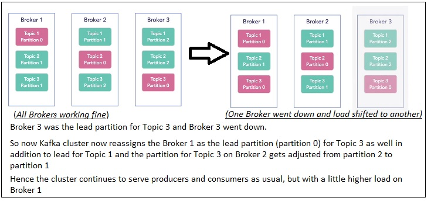
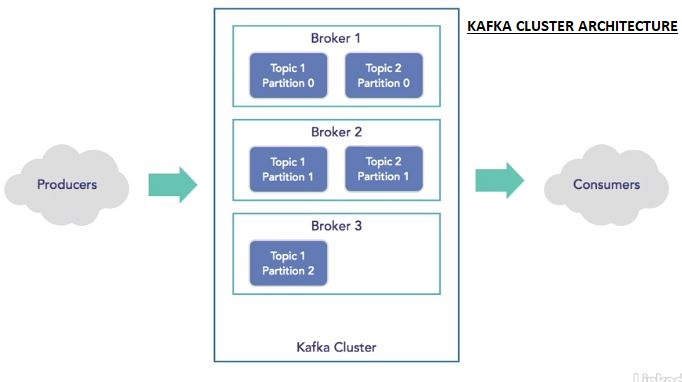

### Kafka Architecture

* Official Documentations:
  * [**Kafka Architecture Documentation**](https://kafka.apache.org/25/documentation/streams/architecture)
  * [**Kafka Documentation**](https://kafka.apache.org/081/documentation.html)
  * [**Kafka QuickStart**](https://kafka.apache.org/quickstart) & [*Another guide from DZone*](https://dzone.com/articles/running-apache-kafka-on-windows-os)

* Data providers make changes to our application and generate entries into our Kafka cluster.
* Consumers are the apps that read those data and use it.
* This econsumers can write some other data and become producers writing back to the Kafka cluster.
* So depending on the operations, the reader and the writer can be the same thing, they can have multiple roles.
* Connectors are the things that allow us to integrate with external systems like relational databases and monitor the changes in them automatically, and pull those changes into our Kafka cluster.
* So we have a single source of the truth, i.e. Kafka Logs. We have an actual true log that has all the changes to a specific entity.
* We also have stream processors which allow us to do the streaming processing where we handle the data as it's coming in on the fly and responding to changes, if necessary.
* Producers send in the data to our Kafka cluster and our consumers pull the data out of Kafka cluster.

### Kafka Cluser internals

* [Explanation on Kafka **Topics, Logs, Partitions**](https://dzone.com/articles/kafka-topic-architecture-replication-failover-and)
* What is a Kafka Topic:
  * Kafka topic is a named stream of records. Kafka stores topics in logs. A topic log is broken up into partitions. Kafka spreads log’s partitions across multiple servers or disks. Think of a topic as a category, stream name or feed.
* **Kafka cluster** has brokers.
* A broker can be considered as a logical separation of partitions of topics, it is just containers or buckets. They handle many topics.
* Brokers can be configured to be on different machines if needed, so it distributes the load and provides multiple backups of your data.
* Each broker handles one or more Kafka topics.
* A Kafka **topic** is basically a *category/feed* of changes.
  * Kafka topics are those entities, things that are changing, those things that you want to keep track of.
  * *Each topic is a separate log in Kafka.*
  * So the customer information scenario, maybe you have a customer topic which has all the information about the customer,
  * or you have one for sales orders,
  * or another topic for facebook posts,
  * or customer visits to a website can be a topic, 
  * or another topic for views of a video, whatever the case may be for your business.
  * 
* All these different topics, each of them are set up inside of a broker.
* *Topics are partitioned across multiple brokers*
  * All the partitions of a single topic hold replicated / duplicate data from the lead topic i.e. partition 0.
  * Producers first write to the lead partition or partition 0, and then data is replicated into other partitions of the topic.
  * Consumers can read from any of the partitions (after a rebalance, i.e. when a consumer is added or removed from a consumer group). The other partitions (follower partitions) are there to resiliency.
  * Offset is the number of changes the consumers have processed or handled since their last read from the topic. In other words it is the index of the change the consumer is going to consume.
  * The consumer read operation happens from different partitions depending on the load (i.e. load balancing across the cluster). As the data is replicated (or duplicated) the offset remaons same for the consumer from the topic even if the consumer is redirected to a different partition.
  * Consumers can be reassigned to a different partition at a rebalance which happens when a consumer is added or removed from a aconsumer group. There can not be more consumers than partitions within a consumer group and each partition is consumed by exactly one consumer in the group. Consumers from diffferent groups can access the same partition.
  * If you have multiple brokers setup in Kafka, you can split those topics across those brokers into partitions. This is how you get the resiliency of the system.
  * So if one broker goes down, or one hard disk fails etc, you still have other copies of the data. So you're never really losing data.
  * When that happens, i.e. when the broker with lead partition fails, one of the "follower" partitions become the lead partition and handles the read-write operations. i.e. The topic whose lead partition was on a broker that went down now shifts its lead partition to one of the other avaialbe partitions and remaining brokers adjust their partitions fo rthat topic. So this way operations can continue without any gap in functionality or capacity.
* 
* Regarding the partitions
  * you have a lead partition, which is where all the writes are occurring.
  * So this is where when new data comes in that writes the data to the actual topic.
  * And then that data is replicated out to the slave partitions or the replicas of that.
  * So this way, one of the brokers is handling all the writes for a specific topic, while all the reads are coming from the other one.
    * Thus we can have a really efficient, fast processing system by balancing the load out this way, without really overloading any one broker or any one topic.
  * All the topics need not be configured to have the same amount of partitions. They all need not be configured the same.
  * There are lots of different ways to approach this, you will have one to many versions of that topic, living across one to many brokers.
  * If multiple partitions exist for a single topic (due to replica count provided), then for any particular topic, each partition goes into a separate broker. Two partitions of the same topic are not set up in the same broker.
  * The leader handles all read and write requests for the partition while the followers passively replicate the leader. If the leader fails, one of the followers will automatically become the new leader. Each server acts as a leader for some of its partitions and a follower for others so load is well balanced within the cluster.
* 
* [**How to decide How many partitions are needed.** ~linkedin](https://www.linkedin.com/pulse/kafka-optimization-how-many-partitions-needed-maria-hatfield-phd#:~:text=For%20most%20implementations%20you%20want,10%2C000%20partitions%20per%20Kafka%20cluster.)
* [**"Why there can not be more consumer instances than partitions per group"** - An Excellent explanation from stackexchange](https://stackoverflow.com/questions/25896109/in-apache-kafka-why-cant-there-be-more-consumer-instances-than-partitions)
* [Apache **Kafka for Beginners** from cloudkarafka](https://www.cloudkarafka.com/blog/2016-11-30-part1-kafka-for-beginners-what-is-apache-kafka.html)
