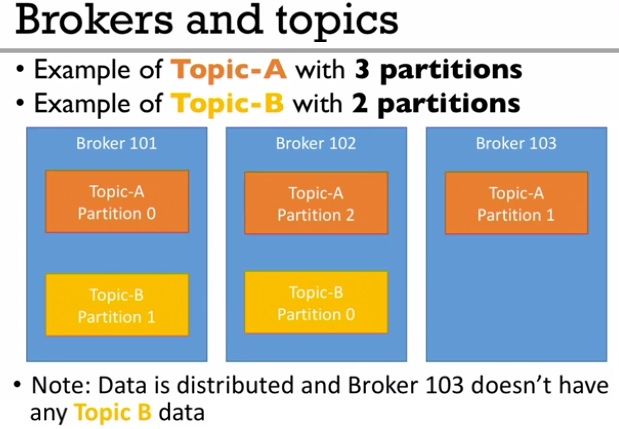
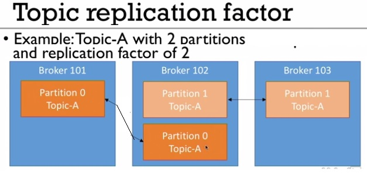
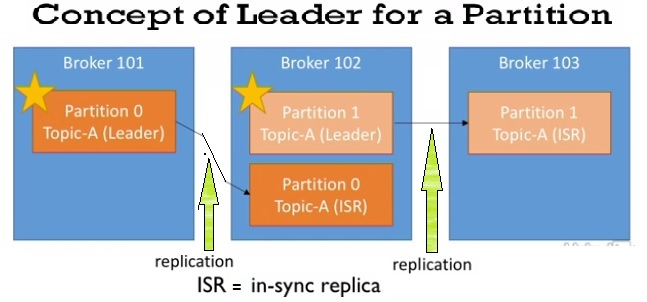
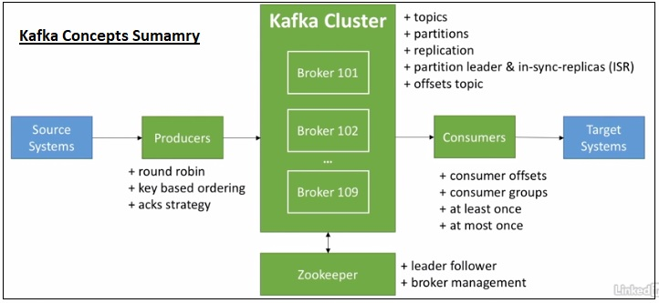

### KAFKA CONCEPTS SUMMARY: 
#### Topics, Partitions & Offsets
* **Topic** is a particular stream of data, similar to a RDBMS table, defined by a specific name.
  * we can have as many topics as we wish
* **Partitions** -- Topics are split into partitions
  * Each message in a partition gets an incremental id , called **offset**
  * Each partition may have different number of messages.
  * Number of partitions are decided at the time of topic creation, matching with number of consumers expected.
  * Offset has a meaning within a partition for a topic, they don';'t have independent meaning.
    * e.g. for a topic the offset 3 of partition 0 does not represent the same data as offset 3 of partition 1
  * kafka gurantee - The order is gurranteed within a partition (for a consumer to read), not among multiple partitions.
  * duration - data in a partition is kept for a week by default.
  * data assignment - data is assigned randomly to a partition, unless key is specified by the producer.to
  * immutable - Once data is written to a partition, it is immutable, i.e. it can not be modified.
  * New messages always get appended at the end of the partition.

#### Broker
* A kafka cluser is comprised of multiple brokers.
* Each broker is a server, identified by a id, a number (broker.id)
* Each broker contains certain topic partitions
* After connecting to a broker (called bootstrap broker), you will be connected to the entire cluster, not only to the specified bootstrap server.
* A good number of brokers to get started with is 3, but big clusters can have even 100 or more brokers.

#### Brokers & Topics
* Partition - is similar to a file.
* For a topic with 3 partitions, each partition will be written onto a different broker in random order, if enough are available, i.e. as long a snumber of partitions does nto exceed the number fo brokers.
* A partition is always identified in combination with topic, e.g. "Topic A, Partition 0". The "partition0" in itself does not have any meaning without a topic.
* If a second topic Topic B with some partitions are created, then cluster assigns the partition 0 (the lead partition of Topic B on a different server than the partition 0 of Topic A.)
* If a topic with partition count more than numebr fo brokers is created then one or more brokers may have more than one partition for the same topic.
* 

#### Topic Replication
* Replication is needed to provide failsafe in a distributed system like Kafka.
* Topics should have "replication-factor"  between 2 (risky) and 3 (good).
* if one broker goes down, another broker takes over.
* E.g. Topic A (TA) with 2 partitions (p0, p1) and replication factor of 2 on 3 brokers (b101, b102, b103):
  * While creating this, first all the partitions are created and evenly distributed among the brokers in some random broker order.
  * Then each of the partitions are replicated with same partition number but onto different brokers.
  * Replication factor of 2 means 2 copies of p0 and two copies of p1 for topic A.
* 
* If a broker (say b102) goes down, then b101 and b103 will continue to serve the data for partition 0 and partiotion 1 respevtively.
* At any given time only ONE broker can be a **leader** for a given partition and only that leader *can receive and serve data for a partition*.
  * The other brokers will synchronize the data.
  * So each partition has one leader and multiple IST (in-sync replica).
* 
* When a broker with a partition leader goes down, then another broker with one of the ISRs of that partition becomes the leader and handles the requests, and later when the broker with previous leader comes up it again tries to become the leader again after replicating the data.
* Zookeeper decides the leader and ISRs. 

#### Producers:
* Producers can choose to receive acknowledgement of data writes:
  * **acks=0** -- producer would not wait for acknowledgement (possible dat loss, may be broker is down and we will not know about the loss). It is very dangerous
  * **acks=1** -- producer will wait for leader acknowledgement (limited dat loss)
  * **acks=all** -- producer will wait for acknowledgement from leader and from all the replicas as well (no data loss as replicas will have the data even when leader broker goes down). This is same as `acks=-1`
* Message Keys (with producers)
  * Producers can choose to send a **key** with the message (string, number etc.)
    * If key is not sent i.e. if key=null, data is sent round robin across partitions of the topic hence across brokers. (first message sent to broker 1, 2nd msg to then b2 then 3rd to b3 and so on.)
    * If a key is sent, then all messages for that key will always go to the same partition (i.e. same broker).
    * A key is basically sent if you need message ordering for a specific field of data.
      * e.g. For a group of trucks sending their locations[lang, lat] to a kafka cluster we will want the data for each truck to be in order, and the truck_id represents a truck so we use truck_id as the message key here. We don't need the data across all the trucks in order.
    * This mechanism of key to partition is called **"Key Hashing"* ??? *.
    * The ordering gurantee is achievable due to "key hashing", which depends on number of partitions.
* If key is not passed by the producer, then the messages are written onto the partitions in round-robin way.
  * I.e. For a 3 partitioned topic if the first write goes to partition 0, seocnd will go to say 2nd partition and 3rd goes to 3rd partiotion, then 4th one will go to partition 0 again adn so on.

#### Consumers:
* Consumers are like a Java application or so.
* Topics are identified by a name and consumers read from the topic.
* When a broker fails consumers, just like producers know how to recover by themselves.RG
* Data is read <u>in order within a partition</u>.
* Say there are 3 partitions for a topic and that topic is read by two consumers.
  * It is possible that a consumer reads from partition p0. DAta in this consumer appear in order
  * And a second consumer can read from two partitions for the same topic some time from p1 some time from p2 and so on. Data in this partition may appear in order only for each partition separately, but offset 5 for p1 may appear before offset3 of p2 partition.

#### Consumer Groups:
* We may define one group per one business application.
* Each consumer within a group reads from exclusive partitions.
* Consumers will automatically use a *GroupCordinator* and a *ConsumerCordinator" to assign a consumer to a partition.
* If there are more consumers than number of partitions, then some consumers will be inactive.
  * We will have more consumers if we expect some of the active consumers to fail so that the inactive consumer takes charge when someother consumer fails.
* All consumers of a consumer group read messages form the same topic.
* The messages read by the consumers from a single consumer group are mutually exclusive,
  * i.e. Once a message is read from the topic by a consumer in the group, that message will not be read by other consumers form the same consumer group as the offset is already changed by the first reader. (MY IDEA - to verify)

#### Consumer Offsets:
* Kafka stores the offsets at which a consumer group has been reading.
* The offsets are commited live in a Kafka topic named "__consumer_offsets".
* When a consumer in a grouo has processed data received from Kafka, it shoudl be committing the offsets.
* If a consumer dies, it will be able to read back from where it left off (due to the committed consumer offsets).

#### Delivery semantics for consumers:
* This comes due to committing offsets.
* Consumers choose when to commit offsets.
* There are 3 delivery semantics:
  * **At most once** (least preferred)
    * Offsets are committed as soon as the message is received.
    * If the processing goes wrong, the message will be lost (it wouldn't be read again)
  * **At least once** (usullay <u>preferred</u>)
    * Offsets are committed after the message is processed.
    * If the processing goes wrong, the message will be read again.
    * This can result in duplicate processing of messages.
      * Make sure your processing is idempotent (processing again the messages won't impact your systems, i.e. the result remains same if a single message iseither processed once or processed multile times).
  * **Exactly once**
    * This last mode can only be achieved for Kafka to Kafka workflows using Kafka Streams API or spark.
    * For Kafka to External Systems (e.g. Database) workflows we need to use an idempotent consumer, as we will not want duplicate records in database.

#### Kafka Broker Discovery:
* Producers and consumers can figure out automatically which broker they can send data to etc.
* Every Kafka broker is also called a "bootstrap server".
  * That means that **you only need to connect to one broker** and you will be connected to the enire cluster.
* Each broker know about all the brokers, topics and partitions (metadata), even though it may not necessarily hold all that data.). It know which broker has which topic and which partition.
  * When a Kafka Client say connets to a broker from the cluster, then on establishment of the connection, the client performs a metadata request and the conencted broker comes back with the list of all brokers in the cluster, their IPd rtc.
  * So when it comes to producing or consuming the client knows which broker it need to connect automatically.
  * This is how **Broker Discovery" works. This discovery is already implemented by the clustery for us.

#### Zookeeper
* It manages the brokers (keeps a list of them)
* Zookeeper helps in performing leader election for partitions.
* Zookeeper sends notifications to Kafka in case of changes (e.g. new topic, broker dies, broker comes up, deletes to topics etc.)
* **Kafka  can't work without zookeeeper.**
* Zookeeper by design (in production) operates with an odd number of servers (3,5,7 etc)
  * In our development we will have one zookeeeper, but in production with a real kafka cluser we will have 3, 5 or 7 Zookeepers.
* Zookeeper has a leader(handle writes), the rest of the zookeeper servers are followers (handle reads)
* The producers and consumers write to kafka, not write to zookeepers. Kafka manages all metadata in Zookeeper.
* Zookeeeper does not store consumer offsets with Kafka > V 0.10, Now consumer offsets are stored in kafka topics.
* E.g. We have a broker cluster of 5 brokers and a zookeeper cluster of 3 zookeepers (only one of the 3 will be a leader and other two ZK's will be followers). Individual brokers might be connected to different zookeepers, but writes will happen only to the leader zookeeeper. So there must be  a connection between the kafka cluster and the zookeeper cluster.
* We as users or developers will be dealing wiht bokers not zookeepers directly.

#### Kafka Gurantees
* Messages are appended to topic-partition in the order they are sent.
* Consumers read messages in the order stored in a topic-partition.
* With a replication factor of N, producers and consumers can tolerate upto N-1 brokers being down.
   * This justifies the good value for a replication factor as 3.
     * Allows one broker to be taken down for maintenance
     * Allows for another broker to be take down unexpectedly.
* As long as the number of partitions remain constant for a topic(no new partition), the same key will always go to the same partition.

#### KAFKA CONCEPTS SUMMARY: 
We discussed on
* Kafka cLuster
  * and topics, partitions, replication, partition leader and ISRs (in-sync replicas)
* Producers
  * and round robin, key based ordering, acks strategy.
* Consumers
  * and consumer offsets, consumer groups, delivery semantics (at least once, at most once).
* Producers
  * and round robin, key based ordering, acks strategy.
* Zookeeper
  * and leader follower mechanism in zoopeeper cluster and
  * broker management
* Producers receive data from "Source Systems" and push to Kafka cluster,  Consumer pulls data from Kafka cluster and after processing it sends data to "Target Systems".
* 
  