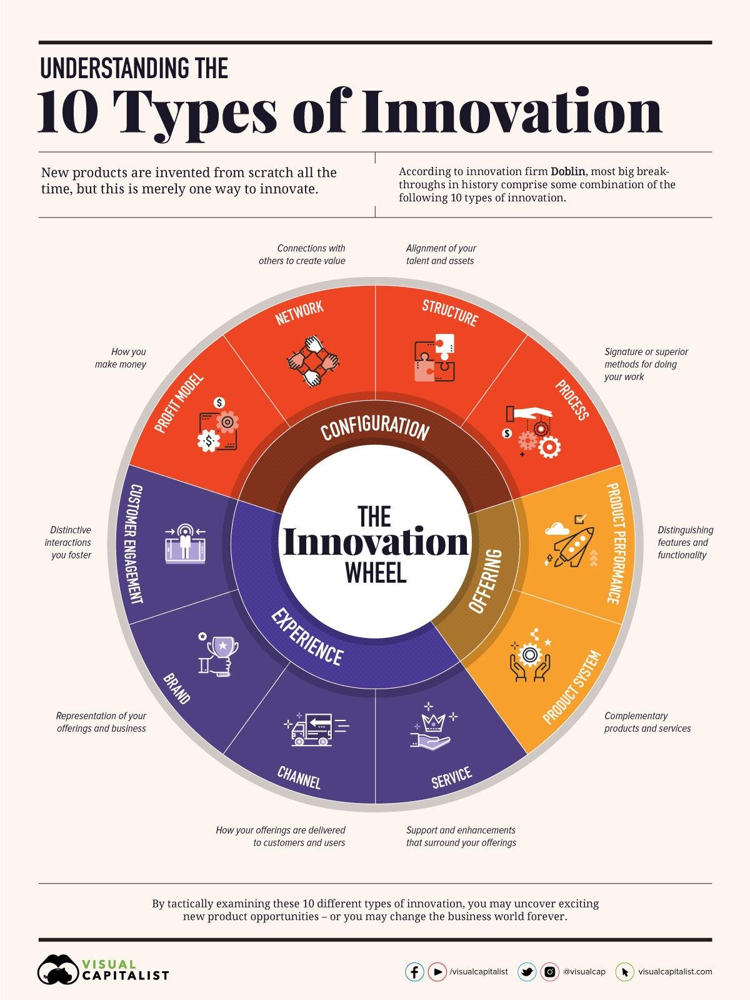

#### StartUp, Innovation etc
* [Even the most crowded markets are never truly full](https://medium.com/swlh/stop-trying-to-invent-the-next-facebook-or-amazon-4c4f9f396978)
  * You don't have to kill yourself trying to invent the next Facebook.
  * You don't have to disrupt an industry to succeed.
  * You can still create significant value in categories most write off as finished.
  * Anytime someone says "that problem has been solved," remember Slack and Zoom have created ~$20B in value in categories most wrote off as finished.
* [How to Protect a Creative Vision - startup](https://medium.com/swlh/how-to-protect-a-creative-vision-3ca3441fc5fd)
* [How to create and nurture a fun, supportive startup culture](https://medium.com/swlh/how-to-create-and-nurture-a-fun-supportive-startup-culture-584d45e62359)
* [How to build a startup - without quitting your day job](https://www.jotform.com/blog/build-a-startup-without-quitting-your-day-job/)
* [Ten Types of Innovation (Detailed Doblin-Deloitte **PDF**)](https://doblin.com/dist/images/uploads/TenTypesInnovation.pdf)  and Explanation [video from Youtube (mindtools)](https://www.youtube.com/watch?v=Q3sfmDkrAI0) and other [mindtool resources](https://www.mindtools.com/)
* [Simplexity Thinking for Innovation by Min Basadur](2013_SimplexityThinking_innovation_min_basadur.pdf)
* 
