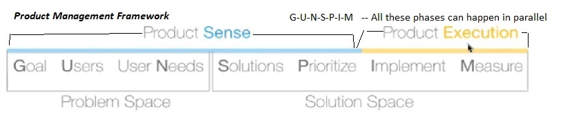

## SUMMARY
#### Product Management: Product Sensing <small>Vaibhav Shrivastava</small>
* MeetUp url: [Event for Product Sensing](https://www.meetup.com/pplbengaluruandhyderabad/events/271666118)
* Youtube Recording: [Product Sensing Webinar record](https://www.youtube.com/watch?v=2dRNzx8Pe54)
* Parent Channel: [Pragmatic Leaders Youtube Channel](https://www.youtube.com/channel/UCVms_Od_ykgOXGdgRq3FYEQ)

Developing Product Sense
* How to think about problems and solutions through a data-driven customer-centric approach
* Things needed to build a innovative and useful and sometimes a industry defining product.
  * This is product sense which has following components:
    * Intelligence
    * Right Opportunity
    * An amaging team
    * Common sense

#### Product Sensing Webinalr Summary (video link mentioned above)
* [Video](https://www.youtube.com/watch?v=2dRNzx8Pe54&t=1m) --> Introduction]
* [Video](https://www.youtube.com/watch?v=2dRNzx8Pe54&t=2m15s) --> Presenter Brief]
* [Video](https://www.youtube.com/watch?v=2dRNzx8Pe54&t=3m40s) --> Agenda] - What is product sense - Why is it critical to product managers - What is the role of customers and data - How to develop these skill
* [Video](https://www.youtube.com/watch?v=2dRNzx8Pe54&t=4m11s) --> What is product sense?
  * Product Sense is the strong intution carried by a product manager that is derived from experience, data and customer obsession. i.e. Custoemr-centricity backed by data and lot of experience of working on actual products.
  * It is the main differentiato between a great product manager froma good product manager.
  * [Video](https://www.youtube.com/watch?v=2dRNzx8Pe54&t=5m20s) --> Product Sence quick summary
* [Video](https://www.youtube.com/watch?v=2dRNzx8Pe54&t=9m15s) --> Why Product Sense it critical to product managers.
  * Product sense is critical and other necessary things are agility, customer focussed, day to day activity etc.
  * "Many times plans are useless but planning is indispensable" - plans will be done, they will change due to changes in business plan and business priority (due to social and political landscape change), that is life of PdM.
  * The roadmap of a product manager should be able to respond to those changes, adapt and reflect those chagnes in the planning. Plans will change, resources will change, technology will change.
  * [Video](https://www.youtube.com/watch?v=2dRNzx8Pe54&t=12m30s) --> Product Management Challenges
* [Video](https://www.youtube.com/watch?v=2dRNzx8Pe54&t=17m35s) --> What is the role of customers and data
  * [Video](https://www.youtube.com/watch?v=2dRNzx8Pe54&t=17m50s) --> What does customer really need (versus what he wants?) - answer lies in data. Need to be addressed. (If you ask customer will say what they want, but we need to relize what they really need.)
  * Our business is a customer-centric system (solar system is a helio centric system where all planets revolve around sun). Similarly our business metric, operational efficiency, revenues all go around customer.
  * The data is like solar gravitational force that ties the business systems with customer.
  * Customer keeps sending data points in a number of ways: usage patterns, primary reports, way they use our product or way they hate our product, product reviews they give at playstore or other forums etc.
  * If we are not understandign the data then we are not moving anywhere. Data does not make sense if we are not metric driven.
  * To save glasses from being wet, someone desinged wiper for glasses and some other intelligent PM desinged contact lenses i.e. want vs need. This needs product innovation etc.
* [Video](https://www.youtube.com/watch?v=2dRNzx8Pe54&t=24m05s) --> How to develop Product Sensse skills
  * Follow webinars but Read more and Explore more to inspire to apply the gained knowledge.
  * [Video](https://www.youtube.com/watch?v=2dRNzx8Pe54&t=24m40s) --> A framework for product management practices by the presenter
  * 
  * Product management framework (<small>with product sense</small>) - These are the guiding questions that PMs must ask and answer.
  * Product Sense
    * **G**oals
      * What are we trying to achieve? - This looks more business-centric.
        * Here "we" means the product manager and his team and the entire organization.
        * What business metric we care about. Clearly identfy and define the goal we, as a PM, we are trying to achieve by creating a feature, launching a new product or makign a improvement.
        * Are we trying to:
          * increase DAUs (daily active users)
          * increase MAUs (monthly active users)
          * retain the customers
          * monetize more customers
          * increase the number of subscription etc, what one or mroe are our goal(s)..
    * **U**sers
      * Who are our users? - Users and theire needs (next point) are the most important ones.
        * E.g. Facebook: - If the goals were "engaggement", "likes", "shares", "comments" and so on,
          * Who are the users - content "creators" / "engagors" / "viewers" for videos / "opinion givers"
            * personas can be created for these types or groups of people, we are creating the product for.
    * User **N**eeds
      * What are the problems or needs of our users?
        * What is that needed to make someone to be able to use a particular product in a specific way.
        * E.g. NEtflix
    * **S**olutions
      * What are the possible solutions to above problems or needs?
        * The solution need not be sophisticated initially, but it should solve teh problem, adn later it can be enhanced. 
    * **P**rioritize
      * Which solutions to build first and try?
          * E.g. Yellopages transformed into JsutDial with a solution of a number dial (88888888) to get yello page information, After many years they came up with a website.
          * What soulution do ypu have and how you will prioritize, e.g solving for speed or for accuracy and so on.
          * What solutions do you want to build and what solution you want first to come out and why.
  * Product Execution
    * **I**mplement
    * **M**easure
* [Video](https://www.youtube.com/watch?v=2dRNzx8Pe54&t=31m38s) --> Q & A
* These are the guiding questions that PMs must ask and answer.

* How a product manager can use **First Principle Thinking** and many other [**Mental Models**](https://www.mindtheproduct.com/mental-models-product-managers) to be able to master this framework and arrive at solutions in a very systematic fashion.
* [The First Principles of Product Management](https://blackboxofpm.com/the-first-principles-of-product-management-ea0e2f2a018c)
* [5 First Principles Approaches to Product Management](https://medium.com/artis-blog/5-first-principles-approaches-to-product-management-cea5b6c5eba0)
* [Articles from MindTheProduct.com](https://www.mindtheproduct.com/?s=first+principle+thinking)

#### Product Sensing from meet up on 5th July 2020
<pre>
* How to get input
Gather customer feedback bike directly talking to them to new customers. Directory talk aur create a forum to collect input
Observe customer usages to get their intention 
for existing customers review them
How to tell no to city or senior product manager
-----------
Go back research collect data then go back to senior management also tell what is the amount of money that will be needed and ROI and provide the metrics of the business need  - go with data - then telling you becomes easier
-----
How to find user pain points
-- which action is performed by most of the customers and what prevents some customers from doing that
For example thousand customer visit your website but 900 of them don't click payments that is a serious problem that is the pin point
-------
Difference between intrapreneur and product manager
Intrapreneur is a superset of product manager
-------
Books
Efforts dot Blog by knowledge projects
How to clear enter product manager
A book from Sachin tikii
-----------
Indian versus outside product manager differences
-- outside good technology is used but in India it is very simplistic
---- 
Product managers need to think ahead for the problems their customers will be facing from outside from scamsters at 17 and try to build those features into product
----
How to involve continuously the customers in a B2B product as there is no Direct customer care in B2B
---  talk to information providers salesperson who are the intermediaries to get input from customer
For B2B use data and analytics heavily
Create focus groups and discuss join meetups to get ideas
------
How to protect resources between two or more products
-- there could be conflicting choices
-- maintain a single metrics.  Consider who are you creating for and what is the business stake.
Find out priority and business need
-----------------
To get into product management first understand why you are doing what you are doing
Read Books by product managers
Read Blocks and videos
Jump into helping other startups that help you gaining product management experience.
-------------
 what is the difference between strategies of Amazon and Netflix
---------
Rational behind customer needing more control over the
-- 
Product manager importance on technology
--  product managers may understand Technology but need not know in depth
-- Production Si Jiski Lucknow street food industry for any product manager it is required
---------------
Communication is critical for product manager
Python is very good for machine learning even the Java may be required
Highlight your side projects on your CV
Product manager initiatives are most important neither education nor past experience just may be needed but not necessary
</pre>